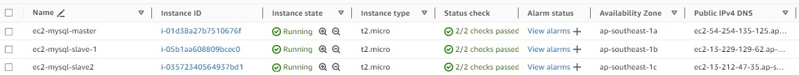
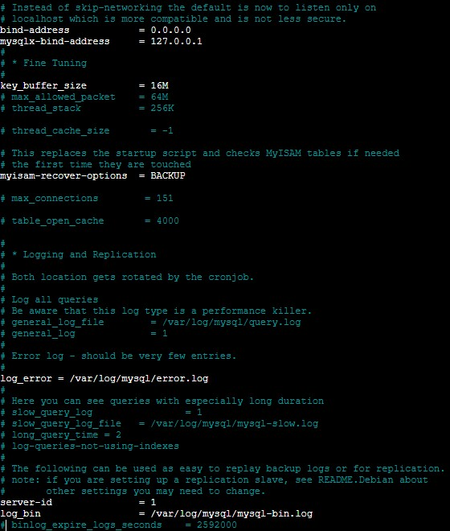
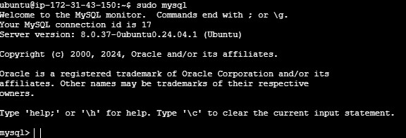
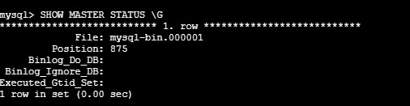
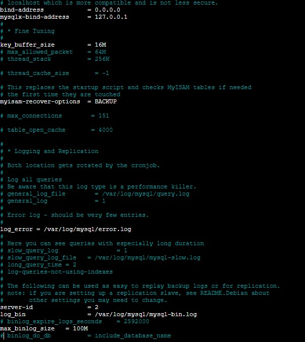
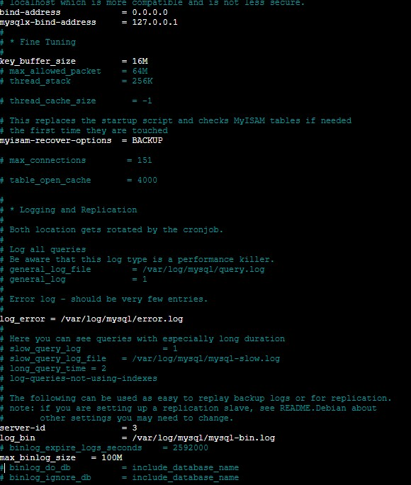
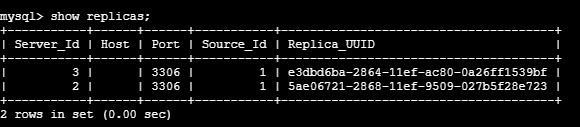

# How to create replicas MySQL 8.0 on EC2 Ubuntu

## 1. Create 3 EC2 instance in "ap-southeast-1" same 1 VPC:

1. EC2 Instance Ubuntu: 
	+ Name: EC2-MySQL-Master
	+ IP: 172.31.43.150 (private) - 54.254.135.125 (public): #known after apply
	+ Security Group: Allow **3306** port MySQL
	+ Zone: **ap-southeast-1a**
2. EC2 Instance Ubuntu:
	+ MySQL Slave1
	+ IP: 172.31.19.183 (private) - 13.229.129.62 (public): #known after apply
	+ Security Group: Allow **3306** port MySQL
	+ Zone: **ap-southeast-1b**
3. EC2 Instance Ubuntu:
	+ MySQL Slave2
	+ IP: 172.31.7.105 (private) - 13.212.47.35 (public): #known after apply
	+ Security Group: Allow **3306** port MySQL
	+ Zone: **ap-southeast-1c**



## 2. Install MySQL 8.0 on EC2-MySQL-Master
``` bash
sudo apt update && sudo apt upgrade - y
sudo apt install mysql-server-8.0 -y
```

+ **After install mysql 8.0 let edit file config**
/etc/mysql/mysql.conf.d/mysqld.cnf

``` bash
sudo nano /etc/mysql/mysql.conf.d/mysqld.cnf
   bind-address = 127.0.0.1 -> bind-address = 0.0.0.0
   #server-id = 1 -> server-id = 1
   #log_bin = /var/log/mysql/mysql-bin.log -> log_bin = /var/log/mysql/mysql-bin.log 
sudo systemctl restart mysql.service
```


+ Login mysql
``` bash
sudo mysql
```


+ Insert mysql query:
``` bash
# Create account for replica slave 1
CREATE USER replication_user@172.31.19.183 IDENTIFIED WITH mysql_native_password  BY 'StrongPassw0rd!';
GRANT REPLICATION SLAVE ON *.* to replication_user@172.31.19.183;
FLUSH PRIVILEGES;
SHOW GRANTS FOR replication_user@172.31.19.183;
# Create account for replica slave 2
CREATE USER replication_user@172.31.7.105 IDENTIFIED WITH mysql_native_password  BY 'StrongPassw0rd!';
GRANT REPLICATION SLAVE ON *.* to replication_user@172.31.7.105;
FLUSH PRIVILEGES;
SHOW GRANTS FOR replication_user@172.31.7.105;
```

+ check status
``` bash
SHOW MASTER STATUS \G
```


**Noted:** **Position: 875**

## 3. Install MySQL 8.0 on EC2-MySQL-Slave 1&2

``` bash
sudo apt update && sudo apt upgrade - y
sudo apt install mysql-server-8.0 -y
```

+ **After install mysql 8.0 let edit file config**
/etc/mysql/mysql.conf.d/mysqld.cnf

+ Set:
    + server-id: 2 for slave1
    + server-id: 3 for slave2

``` bash
sudo nano /etc/mysql/mysql.conf.d/mysqld.cnf
   bind-address = 127.0.0.1 -> bind-address = 0.0.0.0
   #server-id = 1 -> server-id = 2 for slave1 and 3 for slave2
   #log_bin = /var/log/mysql/mysql-bin.log -> log_bin = /var/log/mysql/mysql-bin.log 
sudo systemctl restart mysql.service
```
+ Slave 1



+ Login mysql
``` bash
sudo mysql
```
+ Insert mysql query :
``` bash
CHANGE MASTER TO MASTER_HOST='172.31.43.150',
MASTER_USER='replication_user',
MASTER_PASSWORD='StrongPassw0rd!',
MASTER_LOG_FILE='mysql-bin.000001',
MASTER_LOG_POS=875;

START SLAVE;
SHOW SLAVE STATUS \G
```


+ Slave 2



+ Login mysql
``` bash
sudo mysql
```
+ Insert mysql query :
``` bash
CHANGE MASTER TO MASTER_HOST='172.31.43.150',
MASTER_USER='replication_user',
MASTER_PASSWORD='StrongPassw0rd!',
MASTER_LOG_FILE='mysql-bin.000001',
MASTER_LOG_POS=875;

START SLAVE;
SHOW SLAVE STATUS \G
```


## 4. Testing

[Master]

```bash
SHOW REPLICAS;
```


+ Create database on master and checking status on replica slave

## 5. Clean

+ Select 3 EC2 Instance and **Terminate instances**